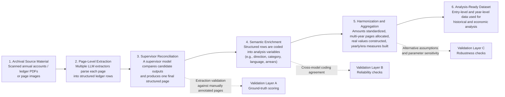
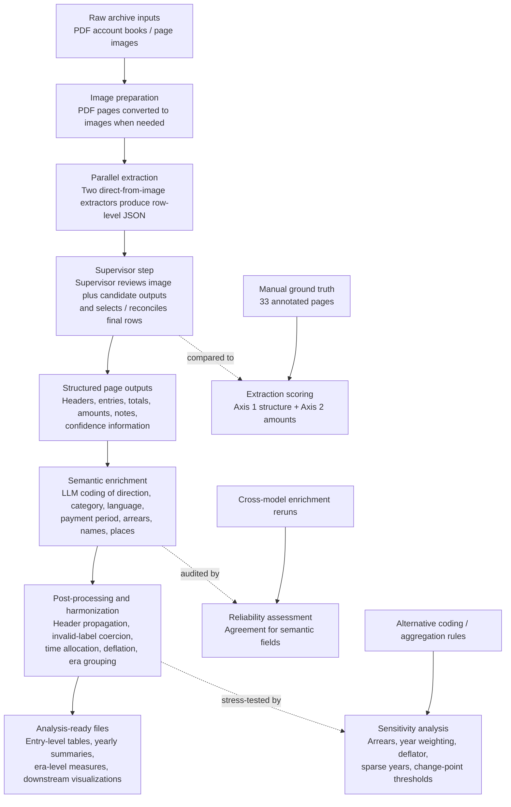

# Historical Ledger Extraction
## Paper-Facing Data Processing Pipeline Sketch

Use this as a draft figure concept for the paper's `Data Preparation / Data Construction / Validation` section.

Recommended positioning:
- This figure should present the workflow as a **data-construction pipeline for substantive analysis**, not as a software-architecture diagram.
- The main purpose is to show how archival source material becomes analysis-ready variables, and where validation enters the process.

Reviewed repository context:
- Repository clone reviewed: `/tmp/historical_ledger_extraction_review`
- Commit reviewed: `e205d66c7a07abf724b15feeaed725e508f3d0c9`

---

## Option A. Main Paper Figure: Clean Six-Stage Pipeline

### Why this version works

- It centers the empirical workflow rather than the engineering workflow.
- It separates `extraction`, `semantic coding`, and `analysis construction`, which is methodologically important.
- It shows validation as layered onto the pipeline rather than treated as an afterthought.

### Intended paper interpretation

- `Stages 1-3` convert archival pages into machine-readable transaction rows.
- `Stage 4` constructs substantively meaningful variables from the extracted rows.
- `Stage 5` creates the time-series and aggregate measures used in the paper.
- The three validation layers support the claim that the resulting data are sufficiently reliable for substantive inference.

---

## Option B. Slightly More Detailed Appendix Figure

### Why this version works

- It is closer to the actual repository workflow.
- It can support a methods appendix or online supplement.
- It makes explicit that some final variables are not directly observed in the source but are created through enrichment and harmonization.

---

## Suggested Figure Caption

**Figure X. Data processing pipeline from archival ledger pages to analysis-ready variables.**  
Scanned archival account pages are first converted into structured row-level records using multiple large-language-model extractors and a supervisor reconciliation step. The resulting rows are then semantically enriched into substantively meaningful variables such as transaction direction, category, language, arrears status, and named entities. These enriched entries are subsequently harmonized into comparable monetary and temporal measures, including year-level and era-level aggregates. Validation enters at three stages: extraction accuracy against manually annotated pages, cross-model reliability of semantic coding, and robustness checks under alternative aggregation and measurement assumptions.

---

## Suggested Short Text for the Paper Body

The data-construction workflow proceeds in five substantive steps. First, scanned archival account books are converted into page-level images where necessary. Second, each page is parsed into structured ledger rows using multiple extraction models. Third, a supervisor model reconciles candidate outputs and produces a final row-level representation of the page. Fourth, the structured rows are enriched into analysis variables, including transaction direction, spending category, language, arrears status, and named entities. Fifth, the enriched entries are harmonized into comparable yearly measures through monetary standardization, time allocation rules for multi-year pages, and aggregation into year- and era-level summaries. We validate the resulting dataset using manually annotated ground-truth pages, cross-model agreement tests for semantic coding, and a set of sensitivity analyses for the most consequential aggregation and measurement choices.

---

## Mapping from Figure Boxes to Repository Files

- `Archival Source Material / Image preparation`
  - [run_all.py](/tmp/historical_ledger_extraction_review/run_all.py:4)

- `Page-Level Extraction`
  - [pipeline/run_pipeline.py](/tmp/historical_ledger_extraction_review/pipeline/run_pipeline.py:143)
  - [src/agents/standalone_extractor.py](/tmp/historical_ledger_extraction_review/src/agents/standalone_extractor.py:25)
  - [src/prompts/standalone_extractor.py](/tmp/historical_ledger_extraction_review/src/prompts/standalone_extractor.py:15)

- `Supervisor Reconciliation`
  - [src/agents/supervisor.py](/tmp/historical_ledger_extraction_review/src/agents/supervisor.py:24)
  - [src/prompts/supervisor.py](/tmp/historical_ledger_extraction_review/src/prompts/supervisor.py:22)

- `Semantic Enrichment`
  - [experiments/enrichment/enrich_supervisor_rows.py](/tmp/historical_ledger_extraction_review/experiments/enrichment/enrich_supervisor_rows.py:140)

- `Harmonization and Aggregation`
  - [experiments/analysis/analysis_enriched.py](/tmp/historical_ledger_extraction_review/experiments/analysis/analysis_enriched.py:151)

- `Ground-Truth Scoring`
  - [src/evaluation/gt_converter.py](/tmp/historical_ledger_extraction_review/src/evaluation/gt_converter.py:1)
  - [src/evaluation/scorer.py](/tmp/historical_ledger_extraction_review/src/evaluation/scorer.py:1)
  - [experiments/run_experiment.py](/tmp/historical_ledger_extraction_review/experiments/run_experiment.py:364)

- `Reliability Checks`
  - [experiments/robustness/reliability_metrics.py](/tmp/historical_ledger_extraction_review/experiments/robustness/reliability_metrics.py:1)
  - [experiments/reports/robustness/reliability/reliability_summary.txt](/tmp/historical_ledger_extraction_review/experiments/reports/robustness/reliability/reliability_summary.txt:1)

- `Robustness Checks`
  - [experiments/robustness/measurement_validation.py](/tmp/historical_ledger_extraction_review/experiments/robustness/measurement_validation.py:1)
  - [experiments/reports/robustness/measurement/measurement_summary.txt](/tmp/historical_ledger_extraction_review/experiments/reports/robustness/measurement/measurement_summary.txt:1)

---

## Recommended Use

- Put `Option A` in the main paper if space is tight.
- Put `Option B` in the appendix if you want to show more of the actual processing logic.
- If the paper is aimed at management, OM, strategy, or economic history readers, keep the labels oriented toward:
  - source material,
  - variable construction,
  - validation,
  - and substantive analysis.
- Avoid presenting the figure primarily as an AI/LLM systems diagram unless the paper's contribution is methodological.

---

## What Still Needs to Be Finalized Before Publication

- The archive/source label needs to be made fully consistent across the paper and repository.
- The exact source inventory and coverage table should be added alongside this figure.
- The figure should eventually reflect the final set of variables actually used in the main results.
- If the paper relies heavily on one or two semantic variables, those should be named explicitly in the final caption or accompanying text.
